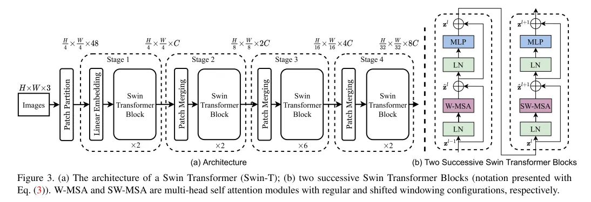

# trt-hackathon-swin-transformer
本次任务的目的是优化[Swin-Transformer模型](https://github.com/microsoft/Swin-Transformer)
## 原始模型
### 模型简介
Swin transformer是微软2021年3月月25日公布的一篇利用transformer架构处理计算机视觉任务的论文，它可以作为计算机视觉的通用backbone。在Swin Transformer之前的ViT和iGPT，它们都使用了小尺寸的图像作为输入，这种直接resize的策略无疑会损失很多信息。与它们不同的是，Swin Transformer的输入是图像的原始尺寸，例如ImageNet的224*224。

继Swin Transformer之后，微软在去年11月份发布了Swin Transformer V2，目前模型的实现以及预训练模型已经开源。Swin Transformer V2的核心是将模型扩展到更大的容量和分辨率，其中最大的模型SwinV2-G参数量达到了30亿，在物体检测任务上图像分辨率达到1536x1536，基于SwinV2-G的模型也在4个任务上达到了SOTA：在图像分类数据集ImageNet V2上达到了84.0%的top1准确度，在物体检测数据集COCO上达到了63.1/54.4的box/mask mAP，在语义分割数据集上ADE20K达到了59.9 mIoU，在视频分类数据集Kinetics-400上达到了86.8%。

Swin Transformer借鉴了许多卷积神经网络的设计理念以及先验知识，它的主要特点是：
- 层级结构：整个模型采取层次化的设计，一共包含4个Stage，每个stage都会缩小输入特征图的分辨率，像CNN一样逐层扩大感受野。
- 滑动窗口注意力：使用了局部性的先验知识，在小窗口使用自注意力就可以了，并不需要去做全局的自注意力。
  

其主要结构如下：
- 通过Patch Partition和Linear Emdedding将将图片切成一个个图块，并嵌入到Embedding。
- 每个Stage中包含Patch Merging和多个Swin Transformer Block。
- 其中Swin Transformer Block主要由LayerNorm,MLP,Window Attention和Shifted Window Attention等组成。

### 模型优化的难点
- 使用源代码模型导出onnx不成功
RuntimeError: Expected all tensors to be on the same device, but found at least two devices, cuda:0 and cpu! 

- 转trt不成功
void myelin::ir::unop_fold(myelin::ir::operation_t*, size_t, size_t, size_t, size_t, const symbolic_shape_t&, const symbolic_shape_t&, const symbolic_shape_t&, output_type*, output_type*) [with output_type = float; size_t = long unsigned int; myelin::symbolic_shape_t = std::vector<myelin::symbolic_value_t>]: Assertion `0' failed.
Aborted (core dumped)

- 由于模型引入了patch merging以及shift window attention机制，在图优化、算子支持方面都有很大优化空间。

### 优化的过程
#### 模型导出和转换
操作步骤[见此处](docs/build_model.md)

### 优化的过程
评估步骤[见此处](docs/eval_model.md)

优化过程中发现，导出的onnx模型转换成tensorrt之后，结果不正确。尝试在导出函数中修改do_constant_folding=False，可以使结果正确。因此下面的测试针对这两种方式分别进行。

速度结果：
针对3种模型，分别测试了在gpu上运行的fps
||pytorch|onnx|tensorrt|
|-|-|-|-|
|fold|41.82|105.80|185.34|
|unfold|41.96|105.61|181.11|

精度结果：
精度结果采用max absolute diff
||pytorch|onnx|tensorrt|
|-|-|-|-|
|fold|-|2.59E-04|NAN|
|unfold|-|2.59E-04|5.93E-04|

优化结果：
根据初赛的经验，将LyerNorm合并之后，会有很大提升，这里也尝试进行了合并操作。
首先使用torchsummary确定了LayerNorm的输入尺寸有128、256、512、1024等四种，因此使用模版生成了这四种kernel函数。
但是实际结果并不理想，在unfold的模型上fps只能到153，需要使用nsight工具进一步分析。

## 经验与体会
之前遇到的模型在tensorrt上能很顺利的完成转换、部署，但是这次SwinTransformer并没有想象中的那么容易。看来要优化部署一个新的模型还是很有挑战的，需要投入大量时间才能完成。